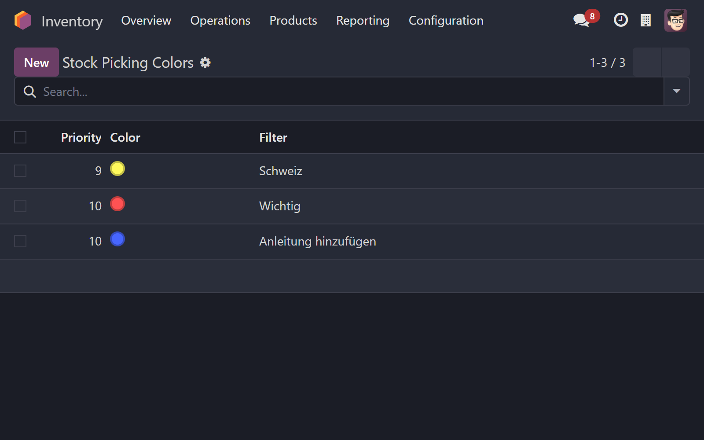

## Die Herausforderung im Lageralltag

In einem geschäftigen Lager zählt jede Sekunde. Ihre Mitarbeiter stehen unter Druck, Bestellungen schnell und fehlerfrei zu kommissionieren. Doch wie behalten sie den Überblick, wenn zahlreiche Aufträge gleichzeitig bearbeitet werden müssen? Insbesondere Aufträge, die eine spezielle Behandlung erfordern – sei es Expressversand, zerbrechliche Ware, ein VIP-Kunde oder besondere Verpackungsanweisungen – gehen in der Masse schnell unter. Das Ergebnis: Übersehene Prioritäten, ärgerliche Fehler und unnötige Verzögerungen.

## Wo Standard-Odoo an seine Grenzen stößt

Odoo bietet zwar leistungsstarke Filter- und Sortierfunktionen für Lageraufträge (Pickings). Doch in der Hektik des Alltags fehlt oft die Zeit, diese Filter ständig neu anzuwenden. Noch wichtiger: Standardmäßig fehlt eine **sofortige visuelle Kennzeichnung**, die wichtige Aufträge auf den ersten Blick aus der Masse hervorhebt. Alle Aufträge sehen gleich aus.

## Die Lösung: Visuelle Intelligenz mit "Stock Picking Colors"

Genau hier setzt unser Modul **"Stock Picking Colors"** für Odoo an! Dieses einfache, aber wirkungsvolle Werkzeug ermöglicht es Ihnen, die Hintergründe von Lageraufträgen (Pickings) in Odoo **automatisch einzufärben**, basierend auf von Ihnen definierten Kriterien.

Stellen Sie sich vor: Ihre Lagermitarbeiter öffnen zu bearbeitende Aufträge in der Odoo Lager-App oder auf ihrem Barcode-Scanner und sehen **sofort**, welche Aufträge besondere Aufmerksamkeit benötigen – dank klar unterscheidbarer Farben.

## Wie funktioniert's? (Einfach und flexibel)

1.  **Regeln definieren:** In den Odoo-Einstellungen legen Sie einfache Regeln fest. Sie wählen Filterkriterien (z.B. Priorität = 'Hoch', Versandart = 'Express', Kunde = 'VIP-Kunde XY', Zielland = 'Schweiz') und weisen diesen Kriterien eine gewünschte Hintergrundfarbe zu.

2.  **Automatische Anwendung:** Das war's! Sobald eine Regel gespeichert ist, werden alle passenden Aufträge der Odoo Lager-App und der Odoo Barcode-App nach dem Öffnen automatisch mit der definierten Hintergrundfarbe angezeigt.

## Ihre Vorteile auf einen Blick:

* ✅ **Sofortige Erkennung:** Kein langes Suchen mehr. Wichtige Informationen springen sofort ins Auge (z.B. Rot für Express, Gelb für zerbrechlich, Blau für VIP).
* 📉 **Fehlerreduzierung:** Das Risiko, spezielle Anforderungen oder hohe Prioritäten zu übersehen, sinkt signifikant.
* ⏱️  **Effizienzsteigerung:** Schnellere Identifikation führt zu schnellerer Bearbeitung wichtiger Aufträge und spart wertvolle Zeit Ihrer Mitarbeiter.
* 🎯 **Klarer Fokus:** Lagermitarbeiter können ihre Arbeit besser priorisieren und wissen sofort, was als Nächstes wichtig ist.
* ⚙️  **Hohe Flexibilität:** Passen Sie die Regeln genau an Ihre individuellen Prozesse und Kennzeichnungen an – nicht nur an Standard-Prioritäten. Heben Sie Aufträge für bestimmte Spediteure, spezielle Lagerzonen oder internationale Sendungen hervor.

## Anwendungsbeispiele:

* Alle **Express-Aufträge** rot einfärben.
* Aufträge für **VIP-Kunden** blau hervorheben.
* Sendungen mit **Gefahrgut oder zerbrechlicher Ware** gelb markieren.
* Aufträge, die eine **spezielle Verpackung** benötigen, grün kennzeichnen.
* **Internationale Sendungen** (z.B. für Zollabwicklung) orange hervorheben.

## Fazit: Ein kleines Modul mit großer Wirkung

Manchmal sind es die einfachen Werkzeuge, die den größten Unterschied machen. **"Stock Picking Colors"** bringt eine intuitive visuelle Ebene in Ihre Odoo Lagerprozesse, die Ihren Mitarbeitern hilft, effizienter und genauer zu arbeiten. Machen Sie Schluss mit dem Übersehen wichtiger Aufträge und geben Sie Ihrem Team die Übersicht, die es braucht.

## Bringen Sie Farbe in Ihr Lager!

Möchten Sie die Übersichtlichkeit in Ihrem Odoo Lager verbessern und Fehler reduzieren?

➡️ [Holen Sie sich das Modul "Stock Picking Colors" direkt im Odoo App Store](https://apps.odoo.com/apps/modules/18.0/ww_stock_picking_colors)

➡️ [Erfahren Sie mehr auf unserer Modul-Seite](/stock_picking_colors)

Haben Sie Fragen oder benötigen Sie spezielle Anpassungen für Ihre Lagerprozesse? Wir von Westwood Software sind Experten für maßgeschneiderte Odoo-Lösungen im Logistikbereich.

➡️ [Kontaktieren Sie uns für eine unverbindliche Beratung!](/contact)

